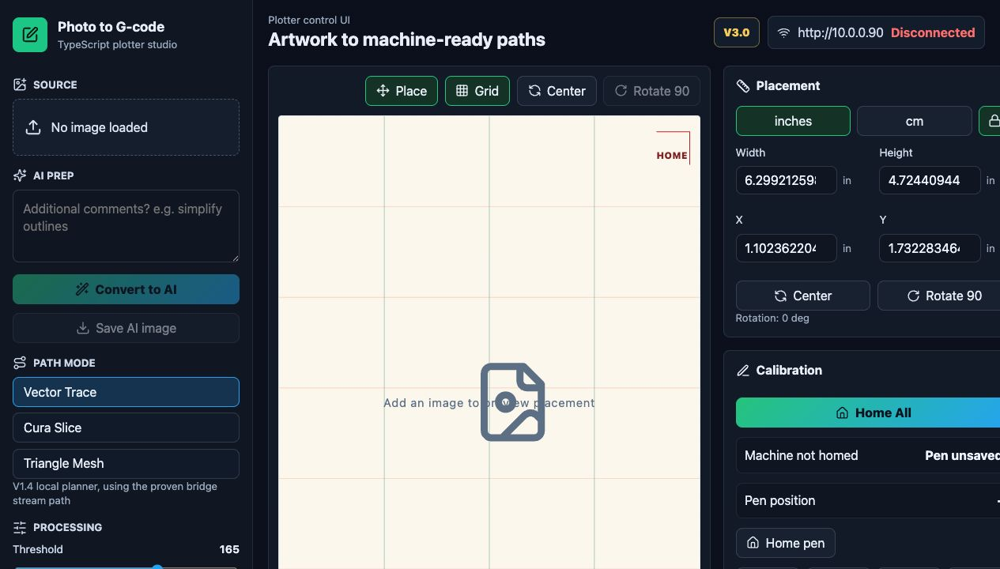

# Photo to G-code

A small local Python tool for turning an uploaded image into simple G-code for a 2-axis pen plotter or drawing CNC.



The project now has two local backends:

- `Custom vector planner`: threshold -> vector/centerline planning -> pen-plotter G-code
- `Cura (experimental)`: threshold -> page placement + cleanup -> STL -> local `CuraEngine` slice -> pen-plotter postprocess

Version 1 focuses on:

- Uploading an image
- Converting it to grayscale and black/white
- Preserving or filtering fine detail in page space
- Tracing thick dark regions as smooth vector-like shapes
- Tracing narrow strokes as centerlines
- Optionally routing the same image through a local CuraEngine slice
- Placing and scaling the Cura mask on the paper before slicing
- Erasing unwanted dark marks before slicing
- Scaling the result to a paper size
- Previewing threshold masks, vector-style fills, and final toolpaths before export
- Generating simple line-based G-code only after approval
- Sending manual jog/status commands through an ESP32 HTTP bridge to test GRBL communication

## Recommended Stack

- Python: easy to read, beginner-friendly, and a strong fit for image processing
- Streamlit: the fastest way to build a simple local UI with upload, preview, and export
- OpenCV: reliable contour detection and image thresholding
- Potrace binding: smoother shape tracing for filled regions
- scikit-image: skeletonization for thin-feature centerlines
- Pillow + NumPy: lightweight helpers for image handling and previews

This keeps the UI, image processing, slicing, and G-code generation separate so you can later add ESP32 sending without rewriting the core logic.

## Project Structure

```text
photo-to-gcode/
├── app.py
├── requirements.txt
├── README.md
└── photo_to_gcode/
    ├── __init__.py
    ├── cura_backend.py
    ├── cura_mesh.py
    ├── cura_postprocess.py
    ├── cura_profile/
    │   ├── definitions/
    │   └── extruders/
    ├── gcode.py
    ├── geometry.py
    ├── image_processing.py
    ├── machine_control.py
    ├── models.py
    ├── planner.py
    ├── preview.py
    ├── thin_features.py
    ├── toolpaths.py
    └── vector_trace.py
├── firmware/
│   ├── arduino_nano_cnc_shield_controller/
│   ├── esp32_grbl_bridge_plotter_hardened/
│   └── esp32_grbl_bridge_servo/
```

## Setup

Use Python 3.11+ on macOS.

```bash
python3 -m venv .venv
source .venv/bin/activate
pip install -r requirements.txt
```

For the Cura backend, install UltiMaker Cura locally in `/Applications`. This project calls the bundled `CuraEngine` CLI directly and does not require any cloud service.

## Run the Streamlit App

From the project folder:

```bash
streamlit run app.py
```

Streamlit will print a local URL, usually:

```text
http://localhost:8501
```

## Run the TypeScript Robot UI

The TypeScript UI is served by the FastAPI backend in `api_app.py`. This is the recommended command when you want the React/TypeScript interface while still using the V3.0 machine-control streaming path:

```bash
source .venv/bin/activate
uvicorn api_app:app --reload
```

Then open:

```text
http://127.0.0.1:8000
```

If port `8000` is already busy, choose another port:

```bash
uvicorn api_app:app --reload --port 8001
```

Then open `http://127.0.0.1:8001`.

The Draw button in the TypeScript UI sends jobs through `/api/machine/draw`, which uses `stream_gcode_to_bridge(...)` with the conservative V3.0 connection settings: one GRBL line in flight, a 24-line acknowledgement window, 6 ms send spacing, GRBL ack/log tracking, transient bridge reconnect handling, and overlap replay for uncertain drawing batches. If the bridge still drops during a long draw, the backend stores a resume point, automatically rewinds a small overlap, retries the connection, lifts the pen, cools down, runs a bridge health handshake, optionally restarts the ESP32 bridge, travels back to the replay point, restores pen-down only when replaying a drawing stroke, and continues the same job when it is safe to do so. The draw stream uses short HTTP command timeouts and pauses on repeated timeout-recovered commands, so a weak ESP32 connection cannot keep drawing one move per timeout in degraded slow mode. The UI shows lost/recovered connection counts, ESP32 reboot count, response latency, and a bridge quality score from the normal job-progress poll, so it does not add extra ESP32 status traffic. Home controls are locked out while a draw is active; a direct Home request during a draw first sends feed-hold and cancels the job instead of sending `$H`, and Home is only sent when GRBL reports Idle or Alarm. Keep this terminal open while drawing; press `CTRL+C` in the same terminal to close the WebUI.

If you edit files in `frontend/src/`, rebuild the served UI first:

```bash
cd frontend
npm run build
cd ..
uvicorn api_app:app --reload
```

## VS Code Workflow

1. Open this folder in VS Code.
2. Open the built-in terminal.
3. Create and activate the virtual environment.
4. Install dependencies with `pip install -r requirements.txt`.
5. Run `streamlit run app.py` for the Streamlit UI, or `uvicorn api_app:app --reload` for the TypeScript UI.
6. Edit the Python files and refresh the app in the browser when needed.

## Cura Backend Notes

The experimental Cura backend works like this:

1. Threshold the image into a page-space black/white mask.
2. Move and scale that mask on the page.
3. Erase unwanted marks directly on the page mask.
4. Convert black pixels into a thin STL on disk.
5. Slice that STL with local `CuraEngine`.
6. Convert Cura extrusion moves into pen-down drawing moves.
7. Preview and save the final plotter G-code.

This is the cleanest way to prove a local Cura integration quickly, but there is one important limitation:

- A raster-derived STL is still raster-derived geometry.
- Cura can generate orderly walls and infill from it, but it cannot magically recover smooth vector curves that are not present in the mesh.

So the best long-term geometry path is:

- threshold image
- trace smooth vector boundaries
- extrude those vectors into STL or 3MF
- slice with CuraEngine

The current implementation proves the local slicer architecture first, while keeping the code structured so the geometry builder can be upgraded later.

## Machine Control

The app now includes an ESP32-over-Wi-Fi machine-control panel for GRBL testing and manual control:

- one ESP32 address field such as `http://10.0.0.88`
- normal GRBL commands sent to `POST /command` as JSON like `{ "cmd": "G0 X10 Y10" }`
- realtime GRBL commands sent to `POST /realtime` as JSON like `{ "rt": "?" }`
- bridge status and recent GRBL log fetched from `GET /status`
- optional log clear sent to `POST /clear-log`
- jog buttons for `X+`, `X-`, `Y+`, `Y-`
- quick buttons for `?`, `!`, `~`, `$I`, `$$`, `$X`, and `$H`

Because this is a Streamlit app, the laptop-side Python process makes the HTTP requests to the ESP32. That avoids browser-side CORS issues in the default workflow. You only need to add CORS headers on the ESP32 if you later replace this with direct browser `fetch(...)` calls to the ESP32.

## Firmware

The `firmware/` folder contains the controller-side code used by the drawing robot:

- `esp32_grbl_bridge_plotter_hardened/`: ESP32 Wi-Fi bridge that receives HTTP commands from the app and forwards GRBL-style serial commands to the motion controller.
- `esp32_grbl_bridge_servo/`: older ESP32 bridge variant with servo pen-up/pen-down support.
- `arduino_nano_cnc_shield_controller/`: compact GRBL-like Arduino Nano/CNC-shield sketch for X, Y, and Z stepper control with three limit switches.

Firmware credentials are intentionally not committed. Copy the relevant `secrets.example.h` file to `secrets.h` inside the firmware folder before flashing locally; `secrets.h` is ignored by git.

## Pen Plotter Notes

The default G-code uses:

- `M5` for pen up
- `M3 S30` for pen down

That is a simple placeholder that often maps well to GRBL-style spindle/servo control, but you may need to change it for your exact servo/firmware setup.

The app also lets you edit:

- Pen up command
- Pen down command
- Feed rate
- Pen settle pause

## Planning Model

The current app plans paths in page space, not raw image space.

- Thick dark shapes are traced as smooth vector-style loops, then turned into perimeter walls plus optional zigzag infill.
- Thin strokes can be split into a separate centerline mode so they plot as a single line instead of a tiny filled blob.
- The pen width is fixed at `0.5 mm`, but the detail-retention control can preserve finer source features in the preview.
- Higher processing resolution uses more of your Mac's CPU/RAM but preserves much more detail.

## Recommended Direction

If your main priority is proving the local slicer workflow, use `Cura (experimental)` first.

If your main priority is smooth path quality right now, the custom vector planner will usually look better than the current raster-to-STL Cura MVP until the Cura geometry builder is upgraded to vector-derived meshes.

## Workflow

1. Upload an image.
2. Adjust threshold, feature filtering, thin-feature, and fill settings.
3. Review the thresholded mask, thick-shape mask, thin-feature mask, smooth vector preview, and toolpath preview.
4. Click `Generate G-code From Current Preview` only when the path layout looks right.
5. Download the `.gcode` file.

## Future Expansion

A clean next step would be adding a transport module for:

- Sending G-code over HTTP or WebSocket to the ESP32
- Saving machine profiles
- Supporting more drawing styles
- Previewing travel moves separately from drawing moves
- Simplifying or reordering paths
